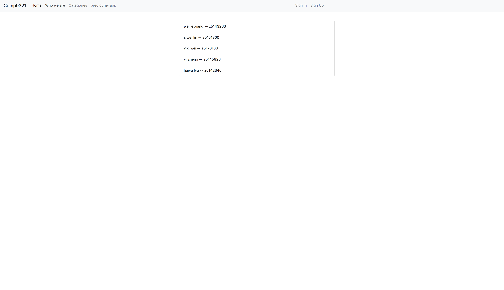
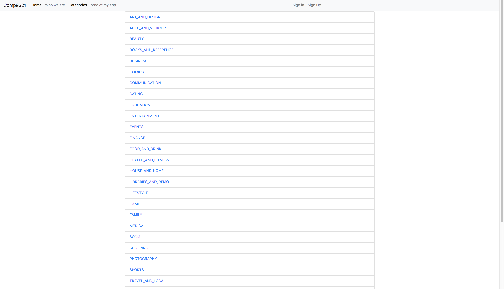
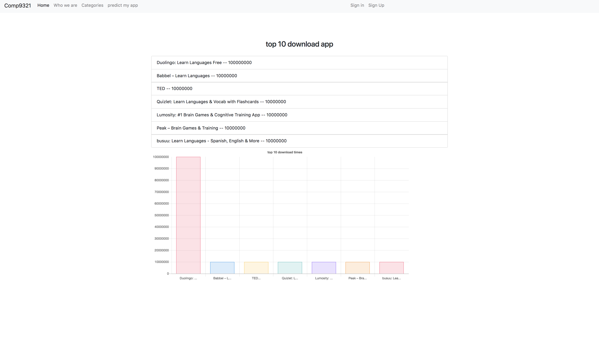
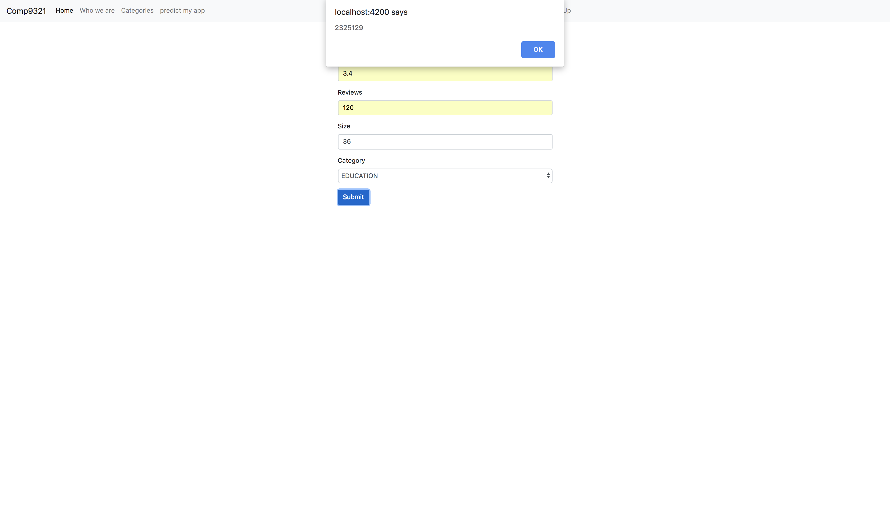
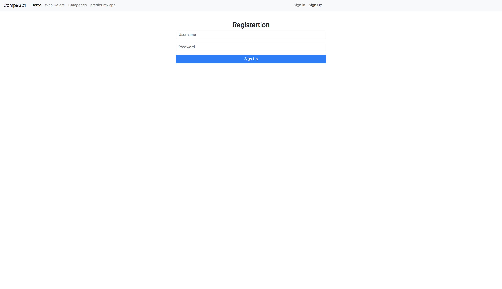
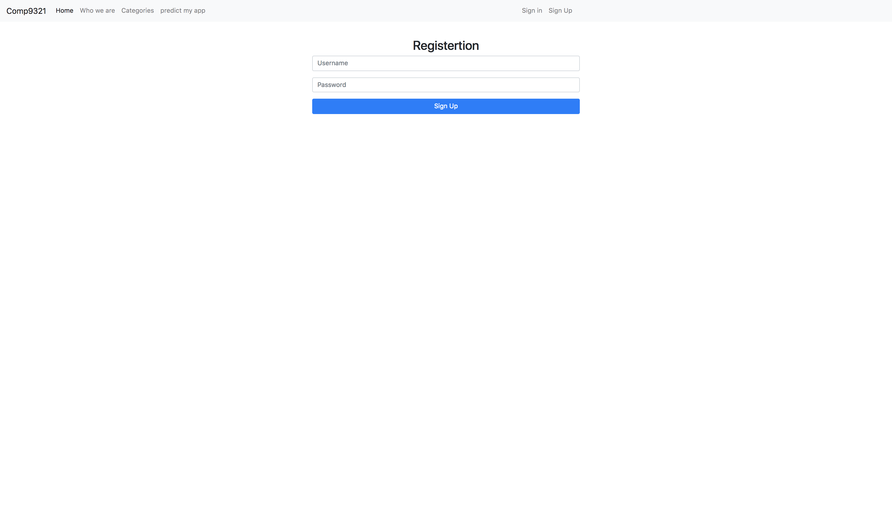
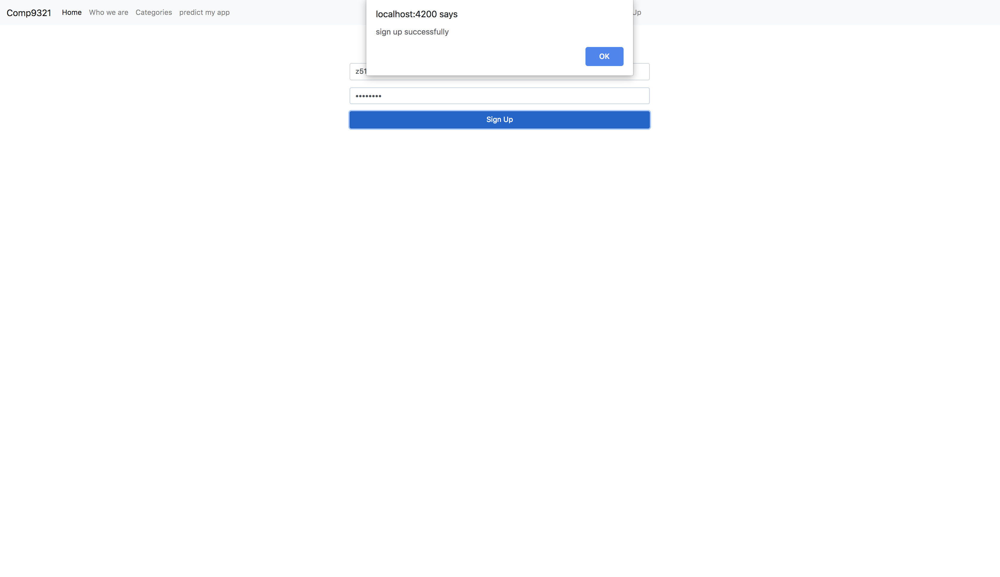
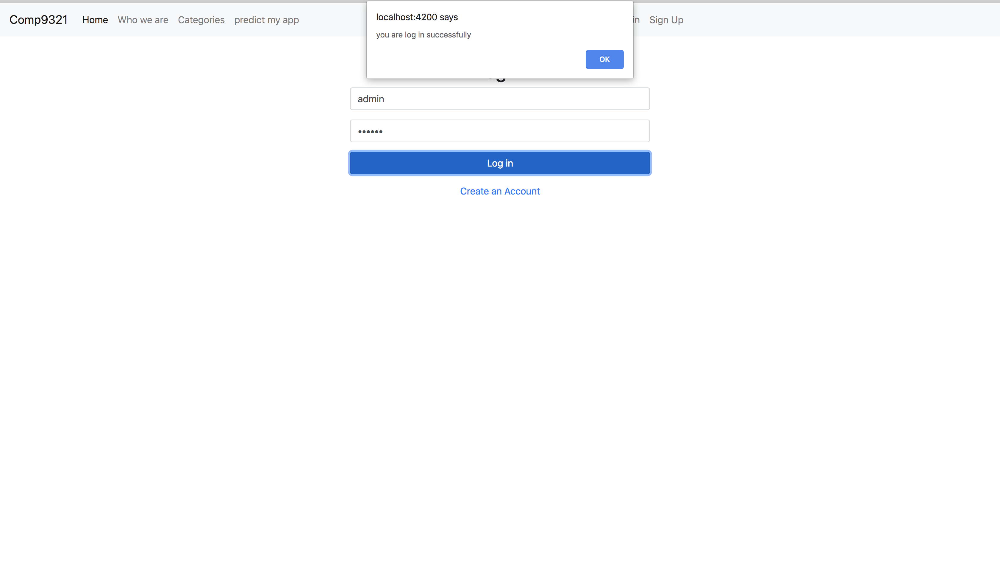
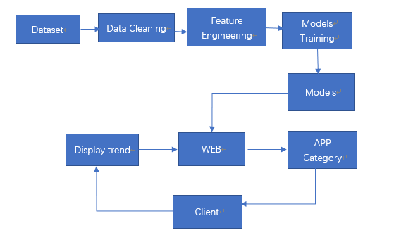

##Predict the installs of popular Apps under different categories in Google Play Store
### introduction:
As there are various apps in the Google play store with too many parameters, it has become a problem for advertisers to choose a product that is worth to invest.
Therefore, we design this service to provide the company with an app ranking from the Google Play Store. Through machine learning, the service can predict the number of installations of the application in the future, which is beneficial to the company's advertising.

### Getting Started:
Home Page:


Group members:

Show all categories:

Select a category:

Predict installs:

Registion and login:






### API:
``` python
@api.route('/register/<string:userName>/<string:password>')
post(self, userName, password) # upload the new user record to MongoDB.
get(self, userName, password) # check inputed value from MongoDB.
@api.route('/genres')
get(self) #Input specific category returns its top ten downloads records.
@api.route('/predict')
get(query) #Input the relevant parameters of the user's product and predict the download volume.
```
### Frame:

- **Dataset**:
dataset from  [Google Play Store Apps](https://www.kaggle.com/lava18/google-play-store-apps) in kaggle
- **Data Cleaning**:
Drop invalid data
Fill NaN data by average number
- **Feature Engineering**:
Modify feature types
Modify feature values
- **Models Training**: 
Multi-value regression
- **Models**:
Linear regression model

### Prerequisite:
> pandas==0.23.4
flask_restplus==0.12.1
Flask==1.0.2
numpy==1.15.2
Flask_Cors==3.0.6
pymongo==3.7.2
scikit_learn==0.20.0


